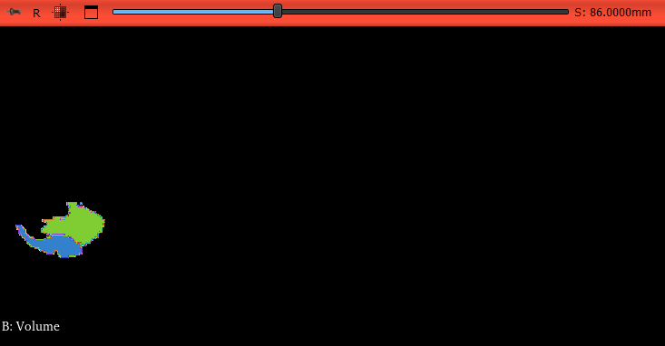

# seg_module

UNetBrainTumorSeg is a 3D Slicer extension named "seg_module" that integrates a  3D UNet trained on BraTS2020 dataset to segment brain tumor area from MRI volumes.

## Prerequisites

3D Slicer 5.0 or later\
Python dependencies:  Pytorch, MONAI, NumPy, vtk (included with 3D Slicer)

## Module UI

## Segmentation example from the module
This is an example of the output after running segmentation. MRI volumes used for this example are from BraTS2020 (volumes that were *not* used for training/validation for the UNet model)

## License 

[MIT](https://choosealicense.com/licenses/mit/)
